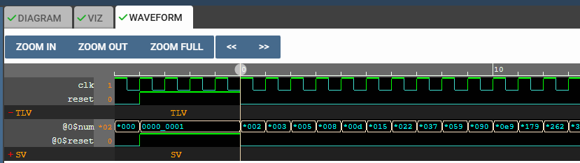
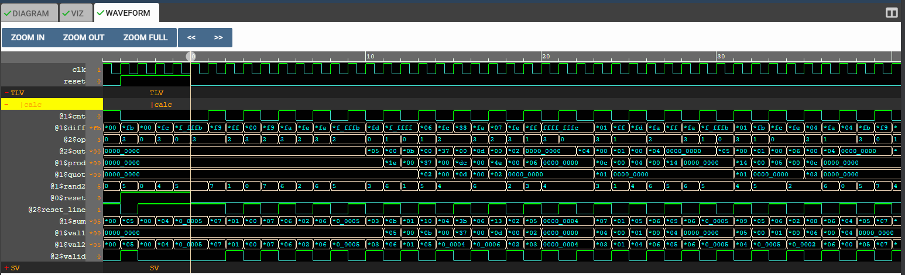

# DAY3

## MUX

### Simple MUX


The TL verilog code for this is

```tlverilog
$out = $sel ? $in1 : $in0 ;
```

### 8-bit MUX


The TL verilog code for this is

```tlverilog
 $out[7:0] = $sel ? $in1[7:0] : $in0[7:0] ;
 ```

## Combinational Calculator


The TL verilog code for this is

```tlverilog
   $val1[31:0] = $rand1[2:0] ;
   $val2[31:0] = $rand2[2:0] ;
   
   $sum[31:0] = $val1[31:0] + $val2[31:0] ;
   $prod[31:0] = $val1[31:0] * $val2[31:0] ;
   $diff[31:0] = $val1[31:0] - $val2[31:0] ;
   $quot[31:0] = $val1[31:0] / $val2[31:0] ;
   
   $out[31:0] = $reset ? 0 : !$op[1] ? !$op[0] ? $sum[31:0] : $diff[31:0] : !$op[0] ? $prod[31:0] : $quot[31:0] ;

```

MakerIDE Project of this [Calculator](https://myth.makerchip.com/sandbox/0zpfRhoN2/0qjh8nJ)


## Sequential Logics

### Fibonacci Series




Code:

```tlverilog
   $num[31:0] = $reset ? 1 : (>>1$num + >>2$num);
```

### Free Running Counter


Code:

```tlverilog
$count[31:0] = $reset ? 0 : ( 1 + >>1$count);
```

### Sequential Calculator


Code:

```tlverilog
   $val1[31:0] = >>1$out ;
   $val2[31:0] = $rand2[2:0] ;
   
   $sum[31:0] = $val1[31:0] + $val2[31:0] ;
   $prod[31:0] = $val1[31:0] * $val2[31:0] ;
   $diff[31:0] = $val1[31:0] - $val2[31:0] ;
   $quot[31:0] = $val1[31:0] / $val2[31:0] ;
   
   $out[31:0] = $reset ? 32'b0 : !$op[1] ? !$op[0] ? $sum[31:0] : $diff[31:0] : !$op[0] ? $prod[31:0] : $quot[31:0] ;
```

## Retiming

### Pythagoras Calculator


Code:

```tlverilog
   |calc

      @0
         $aa_sq[7:0] = $aa[3:0] * $aa[3:0];
         $bb_sq[7:0] = $bb[3:0] * $bb[3:0];
      @1
         $cc_sq[7:0] = $aa_sq + $bb_sq ;
      @2
         $cc[3:0] = sqrt($cc_sq);
```

### Fibonacci 


Code:

```tlverilog
   |fibonacci
      @0
         $op[7:0] = *reset ? 1 : (>>1$op + >>2$op);
```


## LAB : Pipeline

### Reproducing Diagram

#### Question


#### Solution


Code:

```tlverilog

   |comp
      @1
         $error1 = $bad_input || $illegal_operation;
      @3
         $error2 = $error1 || $overflow;
      @6
         $error3 = $error2 || $division_by_zero;

```


### 2-Cycle Counter




MakerChip [Link](https://myth.makerchip.com/sandbox/0zpfRhoN2/0zmhMv6#)

Code:

```tlveriilog
\TLV
   |calc
      @0
         $reset = *reset;

      @1   
         $val1[31:0] = >>2$out ;
         $val2[31:0] = $rand2[2:0] ;
         
         $sum[31:0] = $val1[31:0] + $val2[31:0] ;
         $prod[31:0] = $val1[31:0] * $val2[31:0] ;
         $diff[31:0] = $val1[31:0] - $val2[31:0] ;
         $quot[31:0] = $val1[31:0] / $val2[31:0] ;
         $cnt = $reset ? 0 : (1'b1 + >>1$cnt);
      
      @2
         $valid = $cnt;
         $reset_line = $reset || ~$valid;
         $out[31:0] = $reset_line ? 32'b0 : !$op[1] ? !$op[0] ? $sum[31:0] : $diff[31:0] : !$op[0] ? $prod[31:0] : $quot[31:0] ;

   
   // Assert these to end simulation (before Makerchip cycle limit).
   *passed = *cyc_cnt > 40;
   *failed = 1'b0;

```
