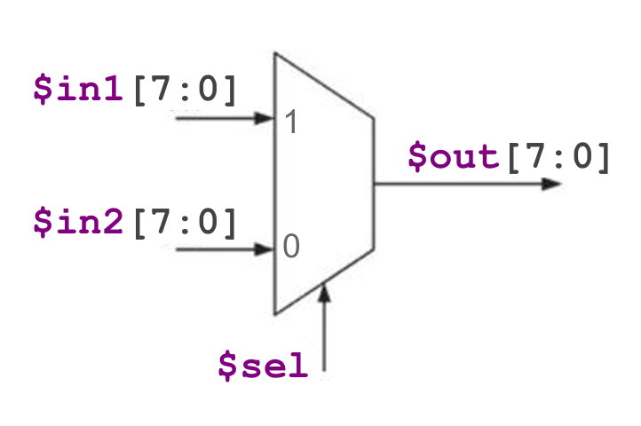

# DAY3

## MUX

### Simple MUX


The TL verilog code for this is

```tlverilog
$out = $sel ? $in1 : $in0 ;
```

### 8-bit MUX




The TL verilog code for this is

```tlverilog
 $out[7:0] = $sel ? $in1[7:0] : $in0[7:0] ;
 ```

## Combinational Calculator


The TL verilog code for this is

```tlverilog
   $val1[31:0] = $rand1[2:0] ;
   $val2[31:0] = $rand2[2:0] ;
   
   $sum[31:0] = $val1[31:0] + $val2[31:0] ;
   $prod[31:0] = $val1[31:0] * $val2[31:0] ;
   $diff[31:0] = $val1[31:0] - $val2[31:0] ;
   $quot[31:0] = $val1[31:0] / $val2[31:0] ;
   
   $out[31:0] = !$op[1] ? !$op[0] ? $sum[31:0] : $diff[31:0] : !$op[0] ? $prod[31:0] : $quot[31:0] ;

```
